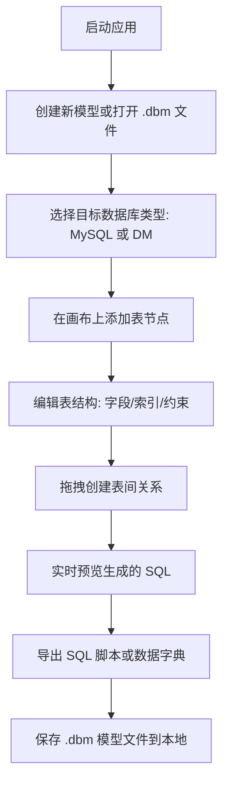

# DBDesigner Pro - 产品需求文档

## 1. 产品概述

一款纯前端可视化数据库表结构设计 Web 应用，支持 MySQL 和 DM（达梦）两种数据库方言的表结构设计、ER 图建模、SQL 生成与导出。无需任何后端或数据库连接，所有数据以本地 JSON 文件形式保存管理。

## 2. 核心功能

### 2.1 功能模块

1. **ER 图画布**: 无限画布、表节点拖拽、关系线绘制、自动布局、缩略图导航
2. **表结构设计**: 字段增删改、约束设置（PK/NOT NULL/UNIQUE）、索引设计、数据类型选择
3. **SQL 工作台**: 实时 DDL 预览、语法高亮、完整 SQL 导出
4. **文件管理**: 新建/打开/保存 .dbm 模型文件、自动保存、最近文件列表
5. **导入导出**: SQL 脚本导出、JSON 模型文件、数据字典（HTML/PDF）
6. **数据库切换**: MySQL ↔ DM 方言切换、数据类型自动映射

### 2.2 页面详情

| 页面 | 模块 | 功能描述 |
|------|------|----------|
| 主界面 | 顶部工具栏 | 新建/打开/保存 .dbm 文件、数据库类型切换、撤销重做、导入导出 |
| 主界面 | 左侧边栏 | 当前模型表列表、搜索筛选、模板库 |
| 主界面 | 中央画布 | ER 图可视化设计器，支持拖拽和缩放 |
| 主界面 | 右侧属性面板 | 表/字段/索引/关系的详细属性编辑 |
| 主界面 | 底部面板 | SQL 预览、数据字典预览 |
| 设置页 | 偏好设置 | 主题切换、快捷键、导出配置 |

## 3. 核心流程

## 4. 用户界面设计

### 4.1 设计风格
- **主题**: 深色专业风格（默认），支持明暗切换
- **主色**: `#0ea5e9` (sky-500) 作为强调色
- **背景**: `#0f172a` (slate-900) 深色画布背景
- **面板**: `#1e293b` (slate-800) 卡片/面板背景
- **字体**: JetBrains Mono（代码）、系统无衬线字体（UI）
- **布局**: 三栏式（左侧面板 + 中央画布 + 右侧面板），底部可折叠 SQL 预览区
- **图标**: lucide-react 图标库

### 4.2 页面设计概述

| 页面 | 模块 | UI 元素 |
|------|------|---------|
| 主界面 | 顶部工具栏 | 扁平按钮组、数据库类型下拉（MySQL/DM）、文件操作、撤销重做 |
| 主界面 | 左侧边栏 | 可折叠面板、当前模型表列表树、搜索框、模板卡片 |
| 主界面 | 中央画布 | 网格背景、表节点卡片、关系贝塞尔曲线、缩略图导航 |
| 主界面 | 右侧面板 | 标签页切换（字段/索引/关系）、表单输入、下拉选择 |
| 主界面 | 底部面板 | 标签页（SQL/字典）、代码高亮、复制/导出按钮 |
| 设置页 | 偏好设置 | 表单布局、开关控件、快捷键表格 |

### 4.3 响应式
- 桌面优先，最小支持 1280x720
- 面板宽度可拖拽调整
- 画布支持 10%-400% 缩放

### 4.4 交互细节
- 表节点拖拽时显示对齐辅助线
- 关系线 hover 高亮并显示外键信息
- 字段编辑支持就地编辑（类似 Excel）
- SQL 预览随模型修改实时更新（防抖 500ms）
- 操作成功/失败 toast 提示
- 文件操作使用浏览器 File System Access API（或降级为下载）
