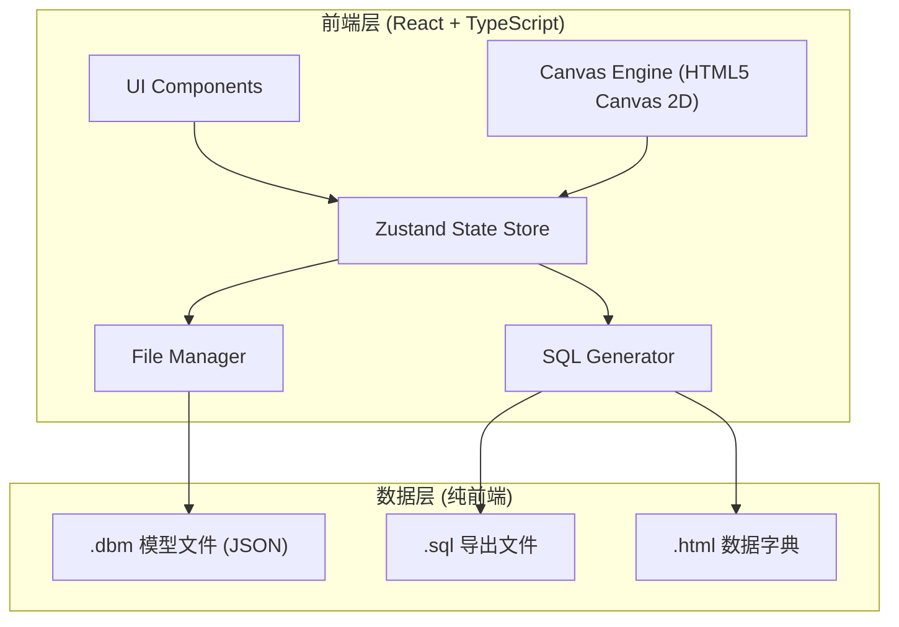

# DBDesigner Pro - 技术架构文档

## 1. 架构设计



## 2. 技术选型

- **前端框架**: React 18 + TypeScript
- **构建工具**: Vite
- **样式**: Tailwind CSS + shadcn/ui
- **状态管理**: Zustand
- **画布引擎**: HTML5 Canvas 2D（自定义实现，支持 100+ 表流畅渲染）
- **代码高亮**: PrismJS
- **图标**: lucide-react
- **文件操作**: 浏览器 File System Access API（降级方案：Blob + a 标签下载）
- **导出**: 纯前端生成（SQL 文本、JSON、HTML 字符串拼接）

## 3. 路由定义

| 路由 | 用途 |
|------|------|
| / | 主设计界面 |
| /settings | 偏好设置 |

## 4. 数据模型

### 4.1 核心类型定义

```typescript
// 模型文件根结构
interface DBModel {
  version: string;
  databaseType: 'mysql' | 'dm';
  tables: Table[];
  relations: Relation[];
  settings: ModelSettings;
}

// 表定义
interface Table {
  id: string;
  name: string;
  comment: string;
  schema?: string;
  engine?: string; // MySQL only
  charset?: string;
  columns: Column[];
  indexes: Index[];
  position: { x: number; y: number };
  width: number;
  height: number;
}

// 字段定义
interface Column {
  id: string;
  name: string;
  dataType: string;
  length?: number;
  precision?: number;
  scale?: number;
  nullable: boolean;
  defaultValue?: string;
  autoIncrement?: boolean;
  isPrimaryKey: boolean;
  isUnique: boolean;
  comment: string;
  ordinal: number;
}

// 索引定义
interface Index {
  id: string;
  name: string;
  type: 'primary' | 'unique' | 'index' | 'fulltext';
  method?: 'btree' | 'hash' | 'gin' | 'gist';
  columns: { columnId: string; order: 'asc' | 'desc' }[];
}

// 关系定义
interface Relation {
  id: string;
  fromTableId: string;
  fromColumnId: string;
  toTableId: string;
  toColumnId: string;
  type: '1:1' | '1:N' | 'N:M';
  onUpdate: 'cascade' | 'set_null' | 'restrict' | 'no_action';
  onDelete: 'cascade' | 'set_null' | 'restrict' | 'no_action';
}
```

### 4.2 模型文件格式 (.dbm)

JSON 格式，版本化存储：

```json
{
  "version": "1.0",
  "databaseType": "mysql",
  "tables": [...],
  "relations": [...],
  "settings": {
    "canvas": { "zoom": 1, "offsetX": 0, "offsetY": 0 }
  }
}
```

## 5. 模块职责

| 模块 | 职责 |
|------|------|
| `src/components/canvas` | 画布渲染引擎、表节点渲染、关系线绘制、交互处理 |
| `src/components/panels` | 侧边面板、属性编辑器、表列表、SQL 预览 |
| `src/components/ui` | 基础 UI 组件（按钮、输入框、下拉框等） |
| `src/store` | Zustand 全局状态：模型数据、UI 状态、历史记录（Undo/Redo） |
| `src/sql-generator` | DDL 生成器（MySQL/DM 方言）、数据字典 HTML 生成 |
| `src/file-manager` | .dbm 文件读写（File System Access API / 下载降级） |
| `src/utils` | 数据类型映射、命名规范检查、模板库、ID 生成 |
