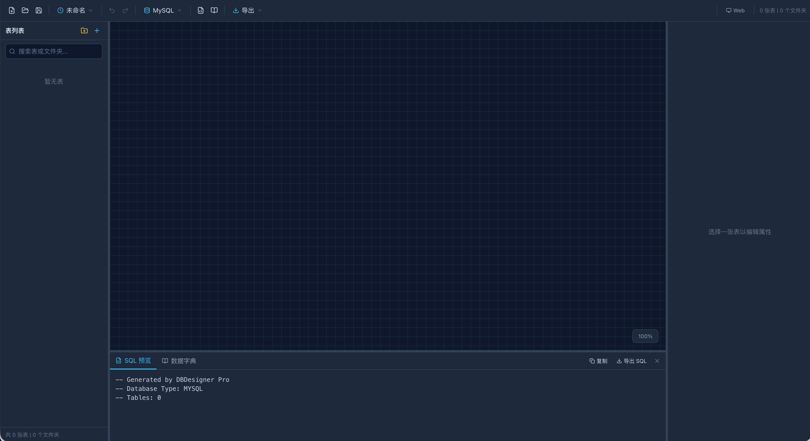

# Create DB

一款专业的数据库表结构设计工具，采用政务风界面，支持可视化 ER 图建模、SQL 生成、数据字典导出等功能。同时支持 MySQL 和 DM（达梦）两种数据库。



## 功能特性

### 核心功能
- **表结构设计**：创建、修改、删除表，定义字段名称、数据类型、长度、约束条件（主键、外键、唯一键、非空、默认值等）
- **关系建模**：可视化展示表间关系（一对一、一对多、多对多），支持拖拽式关系创建与修改
- **SQL 生成**：自动生成 DDL 语句，支持正向工程（从模型生成 SQL）
- **数据库支持**：兼容 MySQL 5.7+/8.0+ 和 DM（达梦）7+/8+

### 画布能力
- **可视化 ER 图**：表卡片按字段数自动加长、字段全部展示（不做省略），支持右下角拖拽调整卡片大小
- **表头颜色配置**：每个表可自定义画布表头背景色（预设色板 + 自定义取色）
- **复制粘贴表**：选中表后 Cmd/Ctrl+C / V 快速复制出新表（含字段、索引、所属文件夹）
- **表/字段注释展示**：表注释显示在表头，字段注释显示在字段行左侧（绿色），两端对齐布局
- **文件夹筛选**：点击文件夹筛选显示其下所有表，画布与 SQL 同步联动
- **层级设置**：右侧可设置表在画布的展示层级（zIndex）

### 字段编辑
- **字段拖拽/序号调整**：输入序号直接调整字段顺序
- **字段列表倒序**：最新添加的字段显示在最上方
- **批量粘贴**：粘贴多行 `名称 类型 注释` 批量创建字段

### SQL 编辑器
- **独立视图**：顶部工具栏切换「画布 / SQL」，SQL 编辑器单独面板（白色工具栏）
- **数据库切换**：MySQL / DM（达梦）切换在 SQL 编辑器内完成
- **随筛选联动**：SQL 只生成当前筛选文件夹内的表（与画布展示一致）
- 支持复制、导出 SQL 脚本

### 数据存储
- **本地 SQLite**：数据保存在 `~/.dbdesigner/CreateDB.db`（与软件名一致）
- **自动保存**：800ms 防抖自动保存 + 关闭前兜底保存 + 启动自动恢复上次模型
- **数据库文件导出/导入**：原生文件对话框备份/恢复数据库，导入前自动备份当前库

### 界面与交互
- **政务风界面**：深藏蓝 + 正红配色、红色短横线标题标记、克制圆角
- **工具栏折叠**：可收起左侧工具栏区域，保留右侧状态区
- **面板控制**：右侧面板默认关闭、选中表自动打开；画布点击空白不弹出
- **原生窗口**（macOS）：WKWebView 原生应用窗口，关闭窗口后台驻留、Dock 点击恢复、Cmd+Q 真正退出

## 技术栈

- **前端**：React 18 + TypeScript + Vite + Tailwind CSS
- **状态管理**：Zustand
- **桌面端**：Go 1.23 + WKWebView 原生窗口（CGO + AppKit）+ SQLite（modernc.org/sqlite，纯 Go）
- **构建工具**：Vite + Go

## 版本支持

| 版本 | 启动方式 | 适用场景 |
|------|----------|----------|
| **macOS 原生应用** | DMG 安装 | 本地离线使用、关闭后台驻留、Dock 管理 |
| **Web 网页版** | `npm run dev` / 部署 | 在线使用、团队协作 |
| **多平台桌面版** | `release/` 可执行文件 | Windows / Linux |

## 快速开始

### Web 开发模式

```bash
# 安装依赖
npm install

# 启动开发服务器
npm run dev
```

### 构建 Web 版本

```bash
npm run build
```

### 构建桌面版本

```bash
# 构建所有平台（macOS 原生 / Windows / Linux）
./desktop/build.sh

# 构建 macOS DMG 安装包
./desktop/build-mac-dmg.sh
```

## 打包产物

- `release/CreateDB-macOS.dmg` - macOS 安装包（Apple Silicon 原生版 + Intel 兜底）
- `release/DBDesignerPro-macOS-arm64` - Apple Silicon 可执行文件（原生版）
- `release/DBDesignerPro-Windows-amd64.exe` - Windows 可执行文件
- `release/DBDesignerPro-Linux-amd64` - Linux 可执行文件

## 项目结构

```
.
├── desktop/                  # Go 桌面端代码
│   ├── main.go              # 公共逻辑（SQLite 存储、REST API、静态服务）
│   ├── main_mac.go          # macOS 原生版（WKWebView 窗口、AppKit 生命周期）
│   ├── main_web.go          # 纯 Go 兜底版（浏览器模式）
│   ├── logo.png             # 圆角应用图标（Dock / Finder）
│   ├── build.sh             # 全平台构建脚本
│   └── build-mac-dmg.sh     # macOS DMG 构建脚本
├── public/                  # 静态资源
├── release/                 # 构建输出目录
├── src/                     # 前端源代码
│   ├── components/
│   │   ├── canvas/ERCanvas.tsx   # ER 图画布
│   │   └── panels/               # Toolbar / LeftPanel / RightPanel / SqlEditor
│   ├── pages/Home.tsx       # 主页面（画布 / SQL 视图切换）
│   ├── store/               # Zustand 状态管理
│   ├── sql-generator/       # SQL 生成器
│   ├── file-manager/        # 文件管理（SQLite API / localStorage 双后端）
│   └── types/               # TypeScript 类型定义
```

## 数据存储

- 数据库文件：`~/.dbdesigner/CreateDB.db`（自动从旧版 `dbdesigner.db` 迁移）
- 自动保存 + 启动自动恢复上次模型
- 支持导出/导入数据库文件（桌面原生版，含自动备份）

## 兼容性

- **操作系统**：macOS 10.15+（原生版）、Windows 10/11（64位）、主流 Linux 发行版
- **浏览器**：Chrome 90+、Firefox 88+、Edge 90+
- **数据库**：MySQL 5.7+、8.0+；DM 7+、8+

## 许可证

MIT License

## 作者

smartartian
